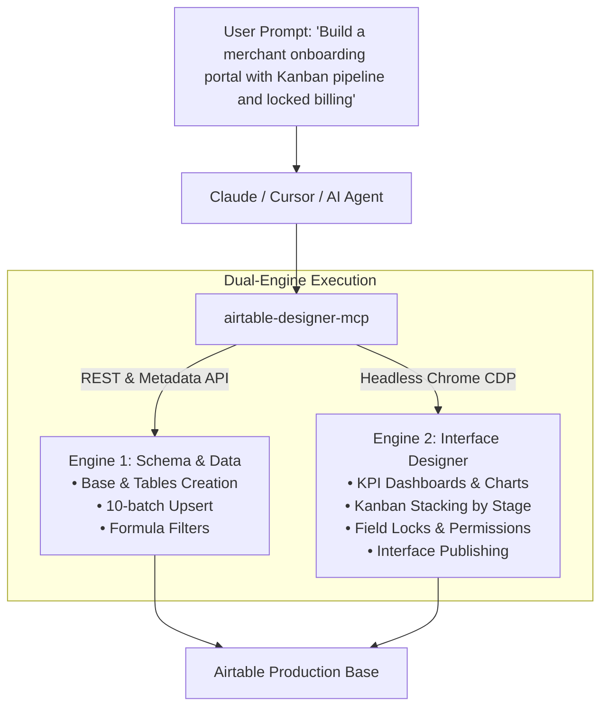
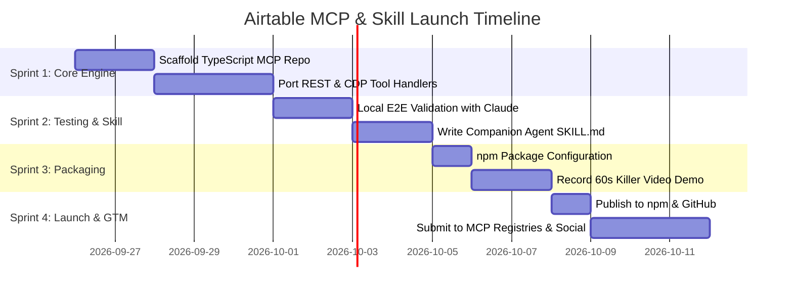

# Airtable Master MCP & Skill: Complete Launch Roadmap

**Author & Creator:** Praroop Anand  
**Target:** The World’s First Full-Stack Airtable MCP Server & Claude Skill  
**Core Value Proposition:** Programmatic control of both Airtable’s Data/Metadata API *and* Airtable’s Interface Designer (Dashboards, Kanbans, Field Locks, and Publishing) through natural language.

---

## 1. Executive Summary & Market Opportunity

### The Market Gap
* **Current State of Airtable MCPs:** Existing open-source Airtable MCP servers only perform basic record CRUD (`list_records`, `create_record`, `update_record`).
* **The Unsolved Pain Point:** Airtable has **zero public API** for **Interface Designer**. Every agency, startup founder, operations lead, and consultant spends countless hours manually clicking, dragging, setting up Kanban boards, configuring column inline edit permissions, and publishing interfaces.
* **The Solution:** By creating a **Dual-Engine MCP** (REST API for schema/data + Chrome CDP Browser Automation for Interface Designer), you allow Claude, Cursor, and Antigravity to **build entire enterprise operations apps from a single prompt**.



---

## 2. Product Architecture: The "Dual-Engine" System

### Engine 1: Data & Schema Engine (Official REST & Metadata APIs)
* **Authentication**: Personal Access Token (PAT) via environment variable `AIRTABLE_API_KEY`.
* **Capabilities**:
  * Create bases, tables, and custom fields (`singleLineText`, `singleSelect`, `currency`, `formula`, `multipleRecordLinks`).
  * Batch record ingestion with automatic 10-record chunking and 5 req/sec rate limit backoff.
  * Server-side record filtering via `filterByFormula`.
  * In-base script creation and webhook management.

### Engine 2: Interface Designer Engine (Browser CDP / Playwright)
* **Connection**: Connects directly to the user's running Chrome session via Chrome DevTools Protocol (`http://127.0.0.1:9223`) or manages a persistent local profile.
* **Capabilities**:
  * **Brand & Navigation**: Rebranding interface headers and sidebar page bundles via double-click automation.
  * **Executive Dashboards**: Placing KPI summary numbers, sequence bar charts, and pivot tables.
  * **Review Queues**: Setting up high-density tables with column-level inline edit locks (`Edit this column inline = OFF`).
  * **Kanban Pipelines**: Configuring cards, stacking by operational stages, and unhiding required badge fields.
  * **Opening Side-Sheets**: Creating 4-block record detail layouts and toggling individual field lock switches.
  * **Publishing**: Triggering interface publishing and confirming multi-page confirmation modals.

---

## 3. The Tool Suite (MCP Tool Definitions)

| Tool Name | Engine | Input Arguments | Description |
| :--- | :---: | :--- | :--- |
| `airtable_create_base_schema` | REST | `base_name`, `tables: []` | Provisions tables, fields, choices, and linked relationships via Metadata API. |
| `airtable_batch_upsert` | REST | `base_id`, `table_name`, `records: []` | Ingests data with automatic 10-record chunking and rate-limit backoff. |
| `airtable_create_interface_page` | CDP | `base_id`, `page_name`, `layout_type`, `table_name` | Creates a new Interface Designer page (Dashboard, Kanban, Grid, Review). |
| `airtable_configure_kanban` | CDP | `base_id`, `page_id`, `stack_by_field`, `card_fields: []` | Stacks Kanban columns by single-select stage and displays front-of-card badges. |
| `airtable_set_field_permissions` | CDP | `base_id`, `page_id`, `locked_fields: []`, `editable_fields: []` | Locks permanent IDs, ingest data, and billing fields while keeping stages editable. |
| `airtable_configure_detail_sheet` | CDP | `base_id`, `page_id`, `title_field`, `blocks: []` | Builds record detail side-sheets with custom blocks and field editability switches. |
| `airtable_publish_interface` | CDP | `base_id` | Finalizes and publishes all interface draft changes to live users. |

---

## 4. Repository & Codebase Structure

Create a clean, production-ready TypeScript repository:

```
airtable-designer-mcp/
├── .github/
│   └── workflows/
│       └── publish.yml          # Automated CI/CD to npm
├── skills/
│   └── airtable-builder/
│       └── SKILL.md             # The companion Claude/Agent skill
├── src/
│   ├── index.ts                 # MCP Server entry point & stdio transport
│   ├── client/
│   │   ├── airtable_api.ts      # REST & Metadata API wrapper
│   │   └── browser_cdp.ts       # Playwright CDP connection & page manager
│   ├── tools/
│   │   ├── schema_tools.ts      # Base, table, field creation
│   │   ├── data_tools.ts        # Batch upsert, querying, filtering
│   │   ├── interface_tools.ts   # Page creation, renaming, dashboards
│   │   ├── kanban_tools.ts      # Stacking, cards, detail modal
│   │   └── permission_tools.ts  # Column and field locking
│   └── types/
│       └── index.ts             # TypeScript interfaces & schemas
├── package.json
├── tsconfig.json
├── README.md                    # Rich documentation with GIF demo
└── LICENSE                      # MIT License
```

---

## 5. Execution Roadmap: 4 Sprints to Launch



### Sprint 1: Scaffold & Implement Core Engine (Days 1–5)
1. Initialize TypeScript monorepo with `@modelcontextprotocol/sdk` and `playwright-core`.
2. Port our verified CDP automation recipes (double-click renaming, column locking, Kanban stacking, detail modal layout, publish modal).
3. Integrate Airtable REST & Metadata API client for table and field provisioning.

### Sprint 2: Agent Skill & Local Validation (Days 6–9)
1. Test with Claude Desktop using `claude_desktop_config.json`:
   ```json
   {
     "mcpServers": {
       "airtable-designer": {
         "command": "node",
         "args": ["/path/to/airtable-designer-mcp/dist/index.js"],
         "env": {
           "AIRTABLE_API_KEY": "pat...",
           "AIRTABLE_CDP_PORT": "9223"
         }
       }
     }
   }
   ```
2. Build the companion `SKILL.md` that teaches Claude standard interface archetypes (Executive Dashboards, Gated Review Queues, Kanban Pipelines, Master Directories) and field-security rules.

### Sprint 3: Packaging & Media Assets (Days 10–12)
1. Set up npm package publishing: `npm publish --access public`.
2. Ensure instant run capability: `npx airtable-designer-mcp`.
3. Record a **60-second video demo / high-FPS GIF**:
   * *The Prompt:* "Create a client portal for an on-demand logistics business with an executive dashboard, a 5-stage onboarding Kanban, and locked billing audit fields."
   * *The Action:* Claude writes schema, opens Chrome, builds the UI live, locks columns, and publishes in 45 seconds.

### Sprint 4: Launch & Distribution (Days 13–15)
1. **GitHub Release**: Launch as public open-source under MIT license with crisp documentation, badges, and the demo GIF.
2. **MCP Registries Submission**:
   * Submit PR to the official Anthropic MCP Registry.
   * List on [Glama.ai](https://glama.ai/mcp/servers), [Smithery.ai](https://smithery.ai), and [PulseMCP](https://pulsemcp.com).
3. **Viral Launch Campaign**:
   * **Twitter / X Thread**: "Airtable has no API for Interface Designer... so I built an MCP server that lets Claude build full Airtable apps for you." (Include the 60s video demo).
   * **LinkedIn Post**: Focus on operational efficiency for operations leads and agency builders.
   * **Reddit**: Share on `r/Airtable`, `r/ClaudeAI`, `r/OpenAI`, and `r/LocalLLaMA`.
   * **Hacker News**: Post as *Show HN: Airtable Designer MCP – Build Airtable Interfaces via Claude*.

---

## 6. Business & Monetization Model

Launching this open-source tool establishes you as the premier authority in AI-driven Airtable systems. You can monetize through 3 channels:

```
┌─────────────────────────────────────────────────────────────┐
│                       OPEN SOURCE                           │
│  airtable-designer-mcp (Free, MIT License, npm + GitHub)    │
│  • Builds massive developer authority & GitHub stars       │
│  • Generates high-volume qualified organic inbound          │
└──────────────────────────────┬──────────────────────────────┘
                               │
                               ▼
┌─────────────────────────────────────────────────────────────┐
│                    COMMERCIAL MONETIZATION                  │
├──────────────────────────────┬──────────────────────────────┤
│ 1. Productized Consulting    │ 2. Pre-Built Agency Kits     │
│  • $3,000–$10,000 per build  │  • $99–$299 starter packs    │
│  • Custom enterprise bases,  │  • Turnkey CRM, recruitment, │
│    intake pipelines & APIs   │    and billing templates     │
└──────────────────────────────┴──────────────────────────────┘
```

1. **High-Ticket Consulting Pipeline ($3k – $10k per project)**:
   * Operations heads, healthcare startups, logistics platforms, and SaaS founders will see your demo and hire you to architect custom AI + Airtable workflows for their companies.
2. **Turnkey Workflow Templates / Kits ($99 – $299)**:
   * Sell pre-packaged schemas, Tally form templates, and automation playbooks for specific industries (e.g. Courier Logistics, Franchise Onboarding, Real Estate Deal Flow).
3. **GitHub Sponsorship & Enterprise Support**:
   * Premium support and custom plugin integrations for agencies building client workspaces.

---

## 7. Immediate Next Actions

1. [x] **Core Mechanics Proven**: All DOM selectors, CDP scripts, and Metadata API interactions verified during the Vape Runners build.
2. [x] **Initialize Package & GitHub**: Initialized `airtable-fullstack-mcp` with TypeScript, Playwright CDP, Zod validation, and pushed to `Praroop1435/airtable-fullstack-mcp`.
3. [x] **Consolidate Tools**: Ported all 10 dual-engine tools (REST/Metadata schema + Chrome CDP Interface Designer).
4. [x] **Publish to npm Registry**: Successfully deployed `airtable-fullstack-mcp@1.0.0` live to npm (`npm i -g airtable-fullstack-mcp` or `npx airtable-fullstack-mcp`).
5. [ ] **Test with Claude Desktop / Live Validation**: Wire up `npx -y airtable-fullstack-mcp` into `claude_desktop_config.json` and run live validation.
6. [ ] **Record Demo & Launch**: Create the 60s launch GIF/video and submit to MCP registries (Smithery, Glama, PulseMCP).
