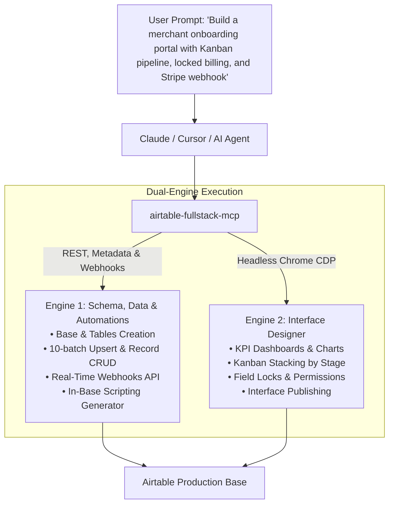

# ⚡ Airtable Full-Stack MCP (`airtable-fullstack-mcp`)

[](https://www.npmjs.com/package/airtable-fullstack-mcp)
[](https://glama.ai/mcp/servers/Praroop1435/airtable-fullstack-mcp)
[](https://smithery.ai/servers/anandpraroop/airtable-fullstack-mcp)
[](https://opensource.org/licenses/MIT)
[](https://www.typescriptlang.org/)
[](https://modelcontextprotocol.io/)

**The World's First Dual-Engine Model Context Protocol (MCP) Server for Airtable.**

Programmatically orchestrate **Airtable's Schema/Data APIs**, **Real-Time Webhooks**, **In-Base Automations Scripting**, and **Airtable's Interface Designer** (Dashboards, Kanbans, Field Locks, and Instant Publishing) through natural language in Claude Desktop, Cursor, or Antigravity.

---

## 🚀 The Unsolved Problem

* **Standard Airtable MCPs fall short**: Existing open-source Airtable tools only support simple record CRUD (`list_records`, `create_record`).
* **Zero Public API for Interfaces**: Airtable provides **no public API** to create or configure **Interface Designer** pages, dashboards, Kanban stacks, or column inline edit permissions.
* **Missing Integration & Automation Bridge**: Connecting webhooks (Tally, Fillout, Stripe, PayPal) and writing in-base automation scripts usually requires tedious manual work.
* **The Solution**: `airtable-fullstack-mcp` bridges this gap via a **Unified Dual-Engine architecture**:
  1. **Engine 1 (Official REST & Metadata APIs + Webhooks + Automations)**: Creates bases, tables, custom fields, links, batch upserts records, manages real-time webhooks, generates in-base automation scripts, and handles full record CRUD.
  2. **Engine 2 (Chrome CDP Browser Automation)**: Connects to your running Chrome session via Chrome DevTools Protocol to build live Interface pages, group Kanbans by stages, lock sensitive audit columns, and publish changes.



---

## 🛠️ Complete MCP Tool Suite (14 Production Tools)

### 1. Schema & Metadata Engine (Official Metadata API)
| Tool Name | Key Arguments | Description |
| :--- | :--- | :--- |
| `airtable_create_base_schema` | `base_id`, `tables: []` | Provisions tables, fields, choices, currencies, and linked relationships. |
| `airtable_list_schema` | `base_id` | Inspects all existing tables, field types, field IDs, and view structures. |
| `airtable_modify_schema` | `base_id`, `table_id_or_name`, `action`, `field_config` | Adds new custom fields, renames columns, or updates table descriptions. |

### 2. Record & Data Engine (Official REST API)
| Tool Name | Key Arguments | Description |
| :--- | :--- | :--- |
| `airtable_batch_upsert` | `base_id`, `table_name_or_id`, `records: []` | Ingests data with automatic 10-record chunking and 5 req/sec rate-limit backoff. |
| `airtable_query_records` | `base_id`, `table_name_or_id`, `filter_by_formula` | Queries records server-side with formula filters, sorting, and pagination. |
| `airtable_manage_records` | `base_id`, `table_name_or_id`, `action`, `record_id` | Single/batch record update (PATCH), deletion (DELETE), or direct ID lookup. |

### 3. Integrations & Automations Engine (Webhooks & In-Base Scripting)
| Tool Name | Key Arguments | Description |
| :--- | :--- | :--- |
| `airtable_manage_webhook` | `base_id`, `action`, `notification_url` | Creates, lists, deletes, and inspects webhooks for real-time external event sync. |
| `airtable_generate_automation_script` | `template`, `table_name`, `field_mappings` | Generates verified JS code for Airtable's native "Run a script" automation action. |

### 4. Interface Designer Engine (Chrome CDP Browser Automation)
| Tool Name | Key Arguments | Description |
| :--- | :--- | :--- |
| `airtable_create_interface_page` | `base_id`, `page_name`, `layout_type`, `table_name` | Creates a new Interface page (Dashboard, Kanban, Grid, Record Review). |
| `airtable_rebrand_interface` | `base_id`, `title`, `sidebar_bundle_name` | Double-click automation to rename interface header and sidebar folder bundles. |
| `airtable_configure_kanban` | `base_id`, `stack_by_field`, `card_fields: []` | Stacks Kanban columns by operational stages and displays front-of-card badges. |
| `airtable_set_field_permissions` | `base_id`, `locked_columns: []`, `editable_columns: []` | Sets column-level inline edit locks (`Edit this column inline = OFF`). |
| `airtable_configure_detail_sheet` | `base_id`, `title_field`, `locked_fields: []` | Configures expandable side-sheet detail cards and toggles field-level lock switches. |
| `airtable_publish_interface` | `base_id` | Finalizes and publishes all interface draft changes, confirming modals. |

---

## ⚡ Quickstart

### 1. Launch Chrome with Remote Debugging
To enable Interface Designer browser automation, launch Chrome with remote debugging:

**macOS:**
```bash
/Applications/Google\ Chrome.app/Contents/MacOS/Google\ Chrome --remote-debugging-port=9223 &
```

**Linux:**
```bash
google-chrome --remote-debugging-port=9223 &
```

**Windows:**
```powershell
& "C:\Program Files\Google\Chrome\Application\chrome.exe" --remote-debugging-port=9223
```

### 2. Configure Claude Desktop
Add to your `claude_desktop_config.json` (located at `~/Library/Application Support/Claude/claude_desktop_config.json` on macOS or `%APPDATA%\Claude\claude_desktop_config.json` on Windows):

```json
{
  "mcpServers": {
    "airtable-fullstack": {
      "command": "npx",
      "args": ["-y", "airtable-fullstack-mcp"],
      "env": {
        "AIRTABLE_API_KEY": "patXXXXXXXXXXXXXX",
        "AIRTABLE_CDP_PORT": "9223"
      }
    }
  }
}
```

Or run directly from local source:
```json
{
  "mcpServers": {
    "airtable-fullstack": {
      "command": "node",
      "args": ["/path/to/airtable-fullstack-mcp/dist/index.js"],
      "env": {
        "AIRTABLE_API_KEY": "patXXXXXXXXXXXXXX",
        "AIRTABLE_CDP_PORT": "9223"
      }
    }
  }
}
```

---

## 🔒 Security Architecture: Locked vs. Editable Matrix

`airtable-fullstack-mcp` makes it easy to enforce strict operational security boundaries:

```
┌──────────────────────────────────────┬──────────────────────────────────────┐
│        🔒 LOCKED / READ-ONLY         │         ✏️ EDITABLE BY USER          │
├──────────────────────────────────────┼──────────────────────────────────────┤
│ • Permanent IDs (VR-M-*, FM-VR-*)    │ • Selection Status Dropdown          │
│ • Raw Ingest Submissions             │ • Onboarding Stage Kanban Cards      │
│ • PayPal / Stripe Receipt IDs        │ • Operational Reviewer Notes         │
│ • Calculated Monthly SaaS Fees       │ • Compliance / Outreach Eligible     │
│ • Courier Settlement Formulas        │ • Emergency Unsubscribed Switch      │
└──────────────────────────────────────┴──────────────────────────────────────┘
```

---

## 📦 Developer Scripts

```bash
# Clone the repository
git clone git@github.com:Praroop1435/airtable-fullstack-mcp.git
cd airtable-fullstack-mcp

# Install dependencies
npm install

# Build TypeScript
npm run build

# Start server locally
npm start
```

---

## 👤 Author & License

* **Author:** Praroop Anand ([@Praroop1435](https://github.com/Praroop1435))
* **License:** [MIT](LICENSE)
